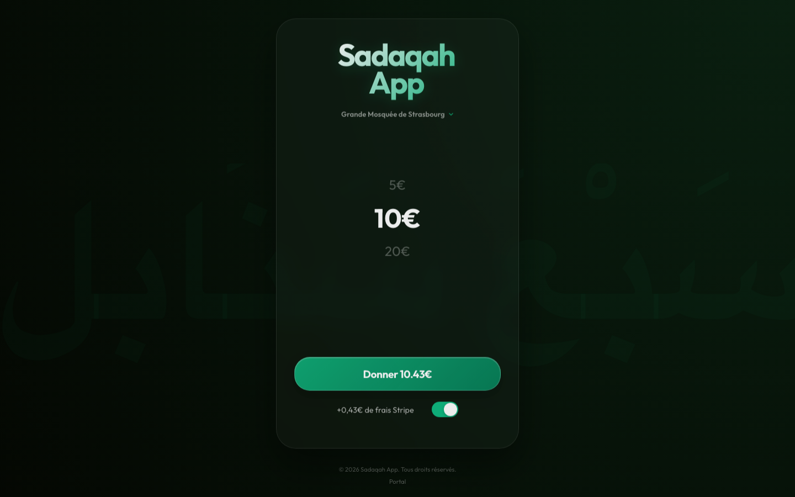
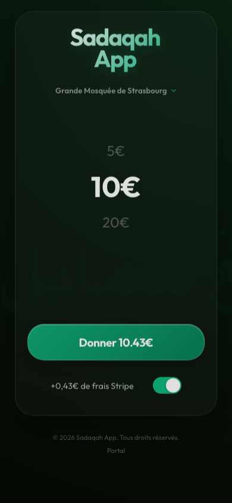

# Sadaqah

A full-stack TypeScript case study for fast mosque donations. Donors choose a
verified mosque, select an amount, optionally cover processing fees, and pay
through Stripe Elements. Operators can start Stripe Connect onboarding, Stripe
webhooks synchronize account capability status to Firestore, and mosque
registration requests are delivered with Resend.

**Live demo:** [sadaqah-mosque-ruddy.vercel.app](https://sadaqah-mosque-ruddy.vercel.app)

> The deployed site is a portfolio demonstration. Do not treat it as a
> production charity or rely on it for tax receipts. Some dashboard figures are
> explicitly mocked and not financial records.



<details>
<summary>Mobile view</summary>



</details>

## Why this project

The project explores a real payment-platform problem rather than a CRUD-only
sample: the application must keep browser code, platform credentials, connected
accounts, webhook events, and operational access in separate trust zones. It
also demonstrates a complete delivery baseline with strict TypeScript, linting,
unit tests, a production build, CI, dependency updates, and deny-by-default
database rules.

## Product flow

1. The donor selects one of the curated Strasbourg-area mosques.
2. A server route validates the mosque and a €1–€1,000 donation amount.
3. The server creates a Stripe PaymentIntent. When a mosque has a configured
   Connect account, Stripe creates the intent in that account.
4. Stripe Elements handles card and supported wallet details in the browser;
   payment credentials never pass through this application.
5. Signed Stripe webhooks update Connect onboarding and payout capabilities in
   Firestore through the Firebase Admin SDK.
6. A separate public form validates mosque applications and sends an operator
   notification through Resend.

## Architecture

- **Frontend:** Next.js 15 App Router, React 19, TypeScript, Stripe Elements,
  responsive CSS, printable QR-code flyers.
- **Server:** Next.js route handlers for PaymentIntents, Checkout Sessions,
  Connect onboarding, signed onboarding refresh links, webhooks, and email.
- **Data:** a curated mosque catalogue in source control; private Connect state
  in Firestore.
- **Integrations:** Stripe/Stripe Connect, Firebase Admin, Resend, Vercel.
- **Delivery:** GitHub Actions, Dependabot, ESLint, TypeScript and Vitest.

The public donation experience reads only the curated catalogue. Firestore is
not exposed to browser SDKs. Operator data is read by an authenticated server
route, and webhook writes use a narrowly scoped Firebase service account.

## Payment trust boundaries

- `NEXT_PUBLIC_STRIPE_PUBLISHABLE_KEY` is intentionally public and only
  initializes Stripe.js.
- `STRIPE_SECRET_KEY`, webhook secrets, Firebase credentials, Resend credentials
  and operator keys are server-only environment variables.
- Amounts and mosque identities are recalculated/validated server-side; client
  metadata is never accepted as authority.
- Stripe hosts the sensitive payment fields. This reduces PCI scope but does not
  by itself make the whole business PCI compliant.
- Webhooks are accepted only after Stripe signature verification.
- Connect account creation requires a 32+ character operator key. Refresh URLs
  contain an HMAC bound to the account ID.
- Return URLs use the configured canonical application origin, not an
  attacker-controlled `Host` or `Origin` header.

## Security posture

- Firestore rules deny all client reads and writes. Server access is controlled
  by Google Cloud IAM through Firebase Admin.
- Admin responses are not cached, API errors avoid leaking provider details,
  email fields are HTML escaped, and public registration input is bounded and
  rate-limited on a best-effort basis.
- Default response headers disable framing, MIME sniffing and unnecessary
  browser capabilities.
- CI runs every quality gate, and Dependabot covers npm and GitHub Actions.

### Known limitations

- Operator access uses a shared API key entered per browser tab. A real
  multi-user deployment should use an identity provider, MFA, role-based
  authorization, audit logs, and key rotation.
- The in-memory registration rate limiter is only a local abuse guard; a
  distributed limiter and bot challenge are needed at scale.
- The admin overview and mosque dashboard contain demonstration data and are not
  accounting systems. Donation ledger persistence, refunds, disputes, receipts,
  reconciliation, and tax workflows are not implemented.
- The catalogue is maintained in code. Connect account IDs must be provisioned
  and reviewed by an operator before connected-account routing is active.
- Webhook event IDs are not persisted for replay auditing. Current writes are
  naturally repeatable, but a production event ledger is still required.
- This repository does not claim regulatory, charity, PCI DSS, PSD2/SCA, GDPR,
  or tax compliance; those require organizational controls beyond source code.

## Local setup

Requirements: Node.js 20+, npm, Stripe CLI, a Firebase project, and a Resend
account.

```bash
git clone https://github.com/alkhastvatsaev/sadaqah.git
cd sadaqah
npm ci
cp .env.example .env.local
npm run dev
```

Fill `.env.local` with test credentials. Never commit that file. Generate the
operator and Connect signing secrets with `openssl rand -hex 32`.

The Firebase service account needs only the Firestore access used by this app.
Store its private key with literal `\n` line breaks as shown in `.env.example`.
Deploy the deny-by-default rules with:

```bash
firebase deploy --only firestore:rules
```

For local webhook testing:

```bash
stripe listen --forward-to localhost:3000/api/stripe/webhook
```

Copy the resulting `whsec_...` value into `STRIPE_WEBHOOK_SECRET`. Configure
Stripe to send at least `account.updated` and `payment_intent.succeeded`.
`APP_URL` must be the exact HTTPS production origin when deployed.

## Quality checks

```bash
npm run lint       # ESLint and Next.js rules
npm run typecheck  # strict TypeScript, no emit
npm test           # Vitest unit tests
npm run build      # production Next.js compilation
```

Tests currently cover security-relevant request validation and escaping.
Provider sandbox integration and browser end-to-end tests remain roadmap items.

## Roadmap

1. Replace the shared operator key with Auth.js/Firebase Auth, MFA and roles.
2. Persist an immutable donation/webhook ledger with replay protection.
3. Add Stripe test-clock/sandbox integration tests and Playwright donation-flow
   tests.
4. Build verified mosque onboarding, document review and account ownership
   controls.
5. Add receipts, refunds/disputes, reconciliation, observability and privacy
   retention tooling.

## Repository map

```text
src/app/                 UI routes and server route handlers
src/app/api/stripe/      Stripe Connect and webhook boundaries
src/lib/server/          Server-only auth, Firebase Admin and validation
firestore.rules          Deny-by-default browser access
.github/workflows/       Continuous integration
```

## Author

Built by [Alkhast Vatsaev](https://alkhastvatsaev.dev) — junior Full Stack JavaScript/TypeScript developer ([portfolio](https://alkhastvatsaev.dev), [FR](https://alkhastvatsaev.dev/fr/developpeur-full-stack)).
